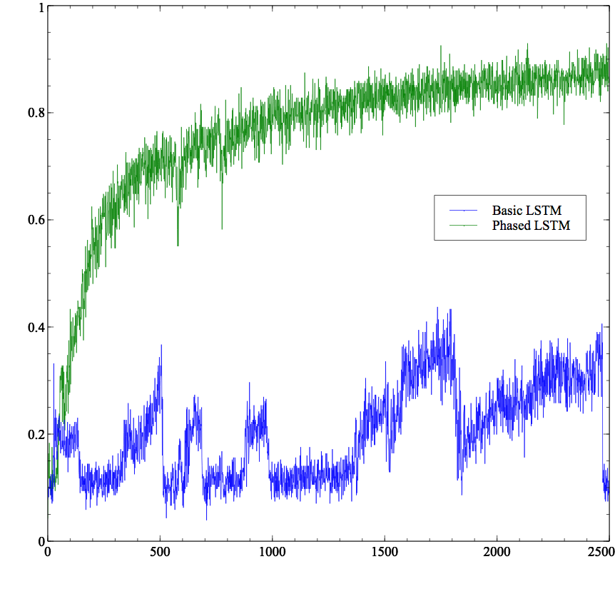
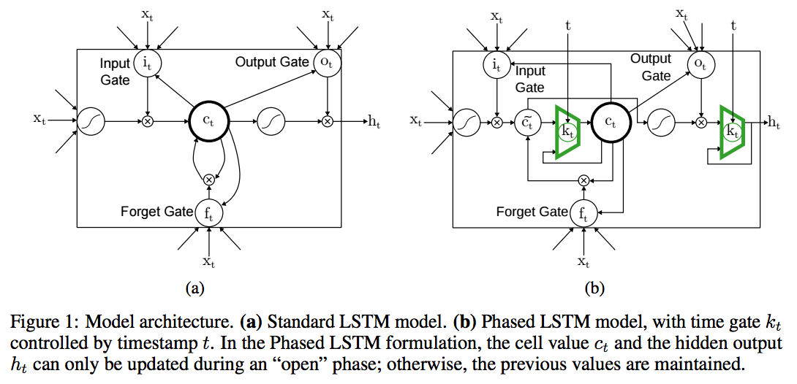
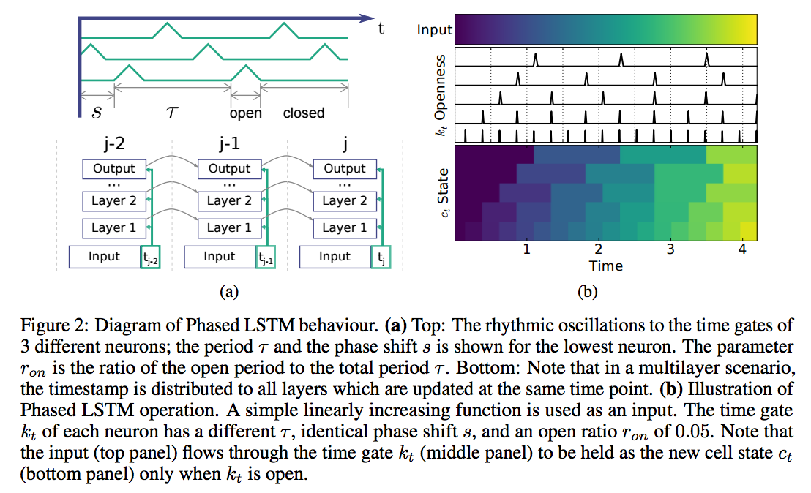
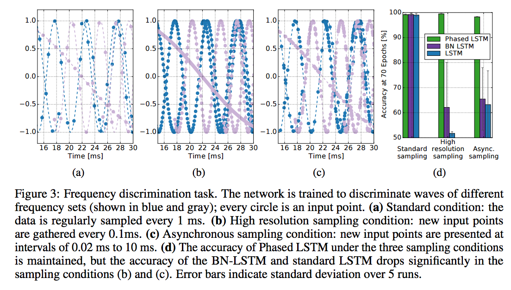
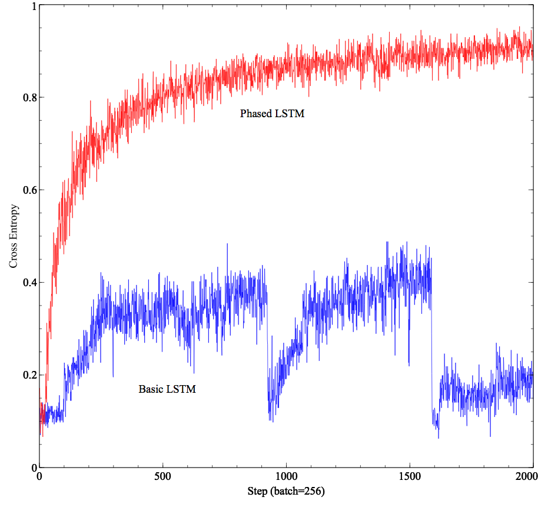
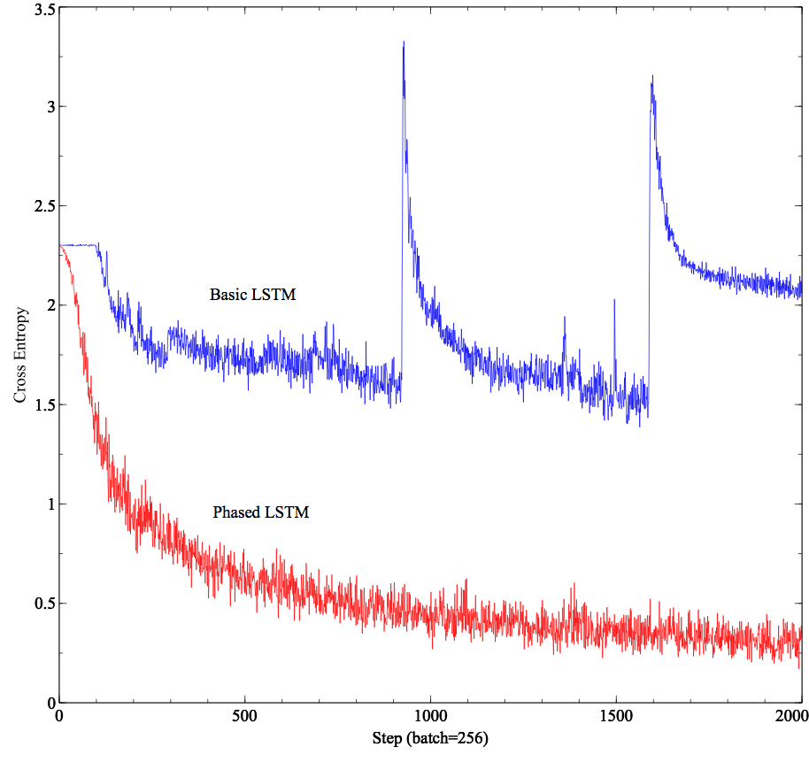

## Phased LSTM: Accelerating Recurrent Network Training for Long or Event-based Sequences (NIPS 2016)
[](https://github.com/philipperemy/keras-attention-mechanism/blob/master/LICENSE) [](https://www.tensorflow.org/)

Tensorflow has released an official version of the Phased LSTM. I wrote a script to show how to use it: 

https://github.com/philipperemy/tensorflow-phased-lstm/blob/master/official_tensorflow_phased_lstm.py

<div align="center">
  <br><br>
  <p><i>Training on the classification of MNIST digits with Phased LSTM and Basic LSTM (official TF implementation)</i></p>
</div>

<hr/>

**NOTE: You can still use this alternative implementation. The code is very similar and it's as fast as the official one (0.8 seconds for a forward-backward pass on a Titan X Maxwell GPU).**

## How to use it?
```
git clone git@github.com:philipperemy/tensorflow-phased-lstm.git plstm
cd plstm
sudo pip install -r requirements.txt
# make sure at least Tensorflow 1.2.0 is installed.
# To reproduce the results of Phased LSTM on MNIST dataset.
python mnist_phased_lstm.py -m BasicLSTMCell
python mnist_phased_lstm.py -m PhasedLSTMCell
```

# Phased LSTM

The Phased LSTM model extends the LSTM model by adding a new time gate, kt (Fig. 1(b)). The
opening and closing of this gate is controlled by an independent rhythmic oscillation specified by
three parameters; updates to the cell state ct and ht are permitted only when the gate is open. The
first parameter, τ , controls the real-time period of the oscillation. The second, ron, controls the ratio
of the duration of the “open” phase to the full period. The third, s, controls the phase shift of the
oscillation to each Phased LSTM cell.

<div align="center">
  <br><br>
</div>

<div align="center">
  <br><br>
</div>

<div align="center">
  <br><br>
</div>


# Resuts on MNIST dataset

Here are the results on the MNIST dataset on the training set. We consider MNIST as long sequences. Clearly with 32 cells, the Basic LSTM implementation cannot learn whereas Phased LSTM does pretty well.

## Training Accuracy
<div align="center">
  <br><br>
</div>

## Training Loss
<div align="center">
  <br><br>
</div>

The Phased LSTM has many surprising advantages. With its rhythmic periodicity, it acts like a
learnable, gated Fourier transform on its input, permitting very fine timing discrimination. Alternatively,
the rhythmic periodicity can be viewed as a kind of persistent dropout that preserves state [27],
enhancing model diversity. The rhythmic inactivation can even be viewed as a shortcut to the past
for gradient backpropagation, accelerating training. The presented results support these interpretations,
demonstrating the ability to discriminate rhythmic signals and to learn long memory traces.
Importantly, in all experiments, Phased LSTM converges more quickly and theoretically requires
only 5% of the computes at runtime, while often improving in accuracy compared to standard LSTM.
The presented methods can also easily be extended to GRUs [6], and it is likely that even simpler
models, such as ones that use a square-wave-like oscillation, will perform well, thereby making even
more efficient and encouraging alternative Phased LSTM formulations. An inspiration for using
oscillations in recurrent networks comes from computational neuroscience [3], where rhythms have
been shown to play important roles for synchronization and plasticity [22]. Phased LSTMs were
not designed as biologically plausible models, but may help explain some of the advantages and
robustness of learning in large spiking recurrent networks.

From: https://arxiv.org/pdf/1610.09513v1.pdf
